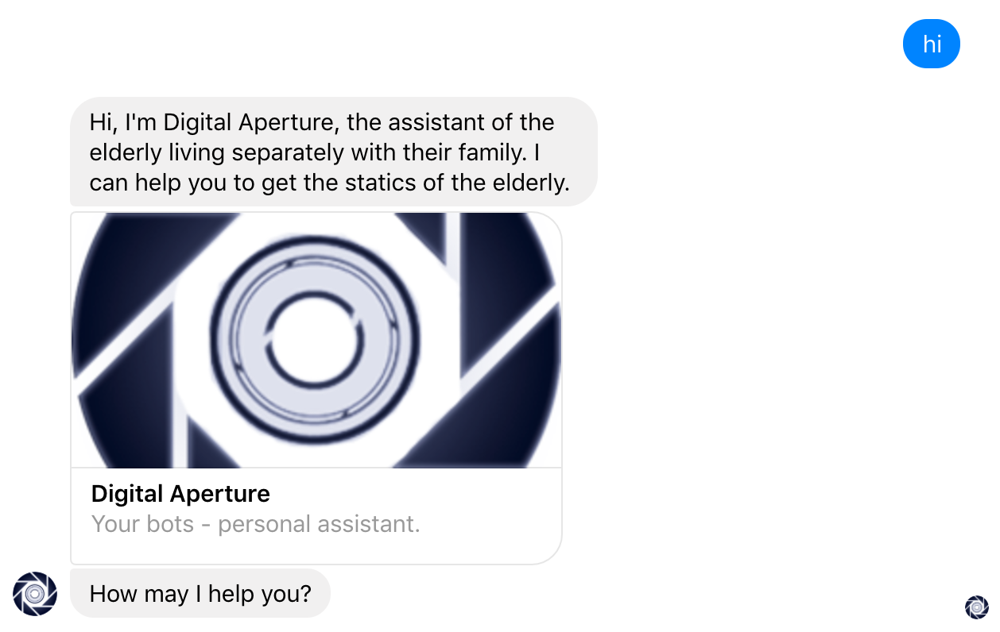
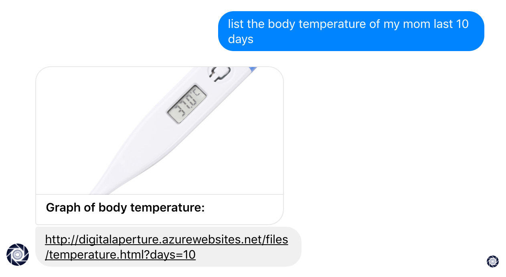
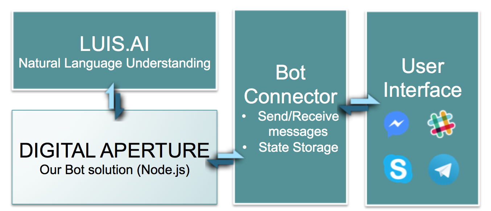

## Digital Aperture
Interactive bot and alert system for elderly living alone and their family members.

Hackathon: ImagineHack 2017 (21-22/01 2017)
### Function
Three kinds of messages has been implemented:
1. Greetings

1. Statics 

1. Exit

### System Structure

The Bot is written in Node.js.
---
### TODO:
1. Receive messages from outside, such as Azure Function
1. Store the data of the elderly